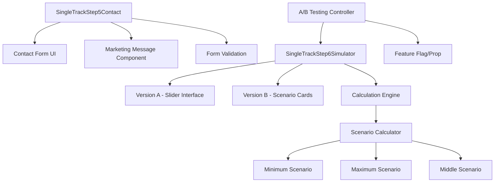

# Design Document

## Overview

This design implements improvements to the single-track calculator's contact step (Step 5) and introduces A/B testing variants for the simulator step (Step 6). The changes focus on streamlining the user experience by removing distracting savings messages from the contact step and providing clearer scenario-based options in the simulator to improve conversion rates.

## Architecture

The implementation follows the existing single-track calculator architecture with minimal changes to maintain compatibility:



The design maintains the existing SingleTrackFormContext for state management and preserves all calculation logic while adding new UI variants.

## Components and Interfaces

### Contact Step (Step 5) Modifications

**Modified Component**: `SingleTrackStep5Contact.tsx`

**Changes Required**:
1. Remove savings-related UI elements:
   - Insurance savings banner
   - LTV ratio messages
   - Savings confirmation checkbox
   
2. Add marketing message component:
   - Hebrew text encouraging phone number entry
   - Positioned near phone input field
   - Mentions WhatsApp report delivery or smart bot usage

**Interface Updates**:
```typescript
interface ContactStepProps {
  // Existing props remain unchanged
  showSavingsMessages?: boolean; // New optional prop (default: false)
}

interface MarketingMessageProps {
  message: string;
  variant: 'whatsapp-report' | 'smart-bot';
  className?: string;
}
```

### Simulator Step (Step 6) A/B Testing

**Modified Component**: `SingleTrackStep6Simulator.tsx`

**New Interface**:
```typescript
interface SimulatorStepProps {
  version: 'A' | 'B';
  // Existing props remain unchanged
}

interface ScenarioCard {
  type: 'minimum' | 'maximum' | 'middle';
  years: number;
  monthlyReduction: number;
  message: string;
}

interface ScenarioCardsProps {
  scenarios: ScenarioCard[];
  onScenarioSelect: (scenario: ScenarioCard) => void;
  currentPayment: number;
}
```

**Version A (Current)**:
- Maintains existing slider-based interface
- No changes to current functionality
- Preserves all existing UI elements

**Version B (Scenario Cards)**:
- Replaces slider with three scenario cards
- Each card displays specific payment reduction and period
- Cards are visually distinct and clickable
- Maintains same calculation logic as slider version

### A/B Testing Infrastructure

**Controller Component**:
```typescript
interface ABTestController {
  version: 'A' | 'B';
  urlParam?: string; // URL parameter name (default: 'simulatorVersion')
  featureFlag?: string;
  fallbackVersion?: 'A' | 'B';
}

// URL-based version detection
const getVersionFromUrl = (): 'A' | 'B' | null => {
  const urlParams = new URLSearchParams(window.location.search);
  const version = urlParams.get('simulatorVersion');
  return version === 'A' || version === 'B' ? version : null;
};

// Usage in parent component
const abTestVersion = getVersionFromUrl() || defaultVersion;
<SingleTrackStep6Simulator version={abTestVersion} />
```

**Configuration Options**:
1. **URL Parameter**: Query parameter `?simulatorVersion=A` or `?simulatorVersion=B` for testing
2. **Feature Flag**: Environment variable or configuration setting
3. **Component Prop**: Direct prop passing from parent
4. **Context-based**: Through SingleTrackFormContext extension

## Data Models

### Scenario Calculation Model

```typescript
interface PaymentScenario {
  years: number;
  monthlyPayment: number;
  monthlyReduction: number;
  totalSavings: number;
  isValid: boolean;
}

interface ScenarioCalculationInput {
  mortgageBalance: number;
  otherLoansBalance: number;
  oneTimePayment: number;
  currentMortgagePayment: number;
  currentOtherLoansPayment: number;
  age?: number;
  propertyValue: number;
}

interface ScenarioCalculationResult {
  minimumScenario: PaymentScenario | null;
  maximumScenario: PaymentScenario | null;
  middleScenario: PaymentScenario | null;
  hasValidScenarios: boolean;
  specialCase: 'insufficient-savings' | 'no-mortgage-savings' | null;
}
```

### Marketing Message Model

```typescript
interface MarketingMessage {
  id: string;
  text: string;
  variant: 'whatsapp-report' | 'smart-bot';
  isActive: boolean;
}

const MARKETING_MESSAGES: MarketingMessage[] = [
  {
    id: 'whatsapp-report',
    text: 'מספר הטלפון ישמש אותנו לשלוח אליך את הדוח המלא בוואטסאפ',
    variant: 'whatsapp-report',
    isActive: true
  },
  {
    id: 'smart-bot',
    text: 'לשימוש בבוט החכם בוואטסאפ אנא הזינו מספר טלפון ישראלי תקין',
    variant: 'smart-bot',
    isActive: true
  }
];
```

## Correctness Properties

*A property is a characteristic or behavior that should hold true across all valid executions of a system—essentially, a formal statement about what the system should do. Properties serve as the bridge between human-readable specifications and machine-verifiable correctness guarantees.*

Based on the prework analysis and property reflection, the following properties validate the system's correctness:

**Property 1: Contact Step Savings Content Removal**
*For any* contact step render, the component should not display savings amount messages, LTV ratio messages, or savings confirmation checkboxes while maintaining all core contact form functionality
**Validates: Requirements 1.1, 1.2, 1.3, 1.4**

**Property 2: Marketing Message Display and Content**
*For any* contact step render, the marketing message should be prominently displayed near the phone input field, contain Hebrew text mentioning WhatsApp or smart bot usage, and encourage valid Israeli phone number entry
**Validates: Requirements 2.1, 2.2, 2.3, 2.4**

**Property 3: A/B Testing Version Support**
*For any* simulator step configuration, the component should render the appropriate interface (slider for version A, scenario cards for version B) based on the version parameter while supporting URL parameter, prop-based, and feature flag configuration
**Validates: Requirements 3.1, 3.2, 3.3, 3.4**

**Property 4: Scenario Cards Structure and Display**
*For any* version B simulator render, exactly three scenario cards should be displayed in separate visual card components, each showing monthly payment reduction and period duration in Hebrew
**Validates: Requirements 4.1, 4.5, 4.6**

**Property 5: Scenario Calculation Logic**
*For any* valid input data, the minimum scenario should show the shortest period with at least 500 NIS savings, the maximum scenario should show the longest possible period, and the middle scenario should fall between minimum and maximum periods
**Validates: Requirements 4.2, 4.3, 4.4**

**Property 6: Special Case Handling**
*For any* input data with insufficient savings potential, the system should display appropriate special case handling: single option for reductions less than 1000 NIS, "אין אפשרות לחסוך" message with insurance options for no mortgage savings, or standard contact button for viable savings
**Validates: Requirements 5.1, 5.2, 5.3, 5.4, 5.5**

**Property 7: Calculation Consistency Across Versions**
*For any* identical input data, both simulator versions should produce identical calculation results, preserve existing mortgage calculation logic, and maintain consistency when switching between versions
**Validates: Requirements 6.1, 6.2, 6.3, 6.4**

**Property 8: Hebrew Text Display and RTL Support**
*For any* text element in the modified components, Hebrew text should be displayed with proper RTL text direction, correct grammar, and appropriate alignment for Hebrew language requirements
**Validates: Requirements 7.1, 7.2, 7.3, 7.4**

## Error Handling

### Contact Step Error Handling

1. **Marketing Message Fallback**: If marketing message fails to load, display default Hebrew text encouraging phone number entry
2. **Form Validation Preservation**: Maintain existing phone number validation and error messaging
3. **Graceful Degradation**: If marketing message component fails, contact form should still function normally

### Simulator Step Error Handling

1. **Version Fallback**: If A/B testing configuration is invalid, default to version A (current slider interface)
2. **Scenario Calculation Errors**: If scenario calculations fail, display error message and fallback to single scenario option
3. **Special Case Handling**: Robust handling of edge cases where no valid scenarios exist
4. **Calculation Validation**: Validate all calculation inputs and provide meaningful error messages for invalid data

### A/B Testing Infrastructure Error Handling

1. **Configuration Validation**: Validate version parameters and provide sensible defaults
2. **Feature Flag Failures**: If feature flag service is unavailable, fallback to prop-based configuration
3. **Component Isolation**: Ensure A/B testing failures don't break the entire simulator step

## Testing Strategy

### Dual Testing Approach

The testing strategy employs both unit tests and property-based tests to ensure comprehensive coverage:

**Unit Tests**: Focus on specific examples, edge cases, and integration points between components. These validate concrete scenarios and error conditions.

**Property Tests**: Verify universal properties across all inputs using property-based testing. These ensure correctness across the full range of possible inputs through randomization.

### Property-Based Testing Configuration

- **Testing Library**: Use `@fast-check/jest` for TypeScript/React property-based testing
- **Test Iterations**: Minimum 100 iterations per property test to ensure thorough coverage
- **Test Tagging**: Each property test references its design document property using the format:
  ```typescript
  // Feature: contact-step-improvements-ab-testing, Property 1: Contact Step Savings Content Removal
  ```

### Testing Focus Areas

**Contact Step Testing**:
- Unit tests for form validation, submission, and error handling
- Property tests for marketing message display and content validation
- Integration tests for form functionality without savings content

**Simulator Step Testing**:
- Unit tests for version switching, scenario card rendering, and special case handling
- Property tests for calculation consistency across versions and scenario logic
- Integration tests for A/B testing infrastructure

**A/B Testing Infrastructure**:
- Unit tests for configuration validation and fallback mechanisms
- Property tests for version consistency and feature flag handling
- End-to-end tests for complete A/B testing workflows

### Test Coverage Requirements

- All correctness properties must be implemented as property-based tests
- Critical user paths must have integration test coverage
- Error handling paths must have unit test coverage
- Hebrew text rendering must have visual regression test coverage

Now I need to use the prework tool to analyze the acceptance criteria before writing the correctness properties:

<function_calls>
<invoke name="prework">
<parameter name="featureName">contact-step-improvements-ab-testing