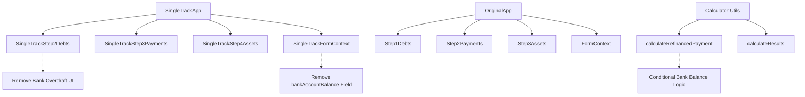

# Design Document

## Overview

This design removes the bank overdraft question and related functionality from the single-track calculator while preserving all other debt tracking capabilities and maintaining the integrity of the original calculator flow. The solution focuses on clean separation between single-track and original calculator behaviors, ensuring no cross-contamination of functionality.

## Architecture

### Component Separation Strategy

The design maintains strict separation between single-track and original calculator components:



### Data Flow Architecture

The system processes financial data differently based on calculator mode:

1. **Single-Track Mode**: Excludes `bankAccountBalance` from all calculations
2. **Original Mode**: Includes `bankAccountBalance` in all calculations
3. **Shared Utilities**: Conditionally handle `bankAccountBalance` based on context

## Components and Interfaces

### SingleTrackStep2Debts Component Modifications

**Current State**: Contains bank overdraft UI section with toggle and input field
**Target State**: Bank overdraft section completely removed

```typescript
// REMOVE: Bank overdraft state management
const [hasBankOverdraft, setHasBankOverdraft] = useState(formData.bankAccountBalance < 0);

// REMOVE: Bank overdraft handlers
const handleBankOverdraftChange = useCallback((e: React.ChangeEvent<HTMLInputElement>) => {
  const value = parseFormattedNumber(e.target.value);
  updateFormData({ bankAccountBalance: -value });
}, [updateFormData]);

const handleBankOverdraftToggle = useCallback((hasOverdraft: boolean) => {
  setHasBankOverdraft(hasOverdraft);
}, []);

// REMOVE: Entire bank overdraft UI section
```

**Validation Changes**: Remove any validation logic that depends on `bankAccountBalance`

### SingleTrackFormContext Interface Updates

**Current Interface**:
```typescript
interface SingleTrackFormData {
  // ... other fields
  bankAccountBalance: number;  // REMOVE THIS
}
```

**Updated Interface**:
```typescript
interface SingleTrackFormData {
  // Step tracking
  step: number;
  
  // Step 2 - Debts (bankAccountBalance removed)
  mortgageBalance: number;
  otherLoansBalance: number;
  // bankAccountBalance: number; // REMOVED
  
  // ... rest remains unchanged
}
```

**Initial Data Updates**:
```typescript
const initialSingleTrackFormData: SingleTrackFormData = {
  // ... other fields
  // bankAccountBalance: 0, // REMOVED
};
```

### Calculator Utility Modifications

**Current Calculation Logic**:
```typescript
const otherLoansAmount = data.otherLoansBalance + Math.abs(data.bankAccountBalance);
```

**Updated Logic with Context Awareness**:
```typescript
// Add context parameter to identify single-track vs original calculator
const calculateRefinancedPaymentSingleTrack = (data: SingleTrackFormData): TrackCalculationResult => {
  const mortgageAmount = data.mortgageBalance;
  const otherLoansAmount = data.otherLoansBalance; // No bankAccountBalance
  const totalAmount = mortgageAmount + otherLoansAmount;
  // ... rest of calculation logic
};

// Original calculator function remains unchanged
const calculateRefinancedPayment = (data: FormData): TrackCalculationResult => {
  const mortgageAmount = data.mortgageBalance;
  const otherLoansAmount = data.otherLoansBalance + Math.abs(data.bankAccountBalance);
  const totalAmount = mortgageAmount + otherLoansAmount;
  // ... existing logic unchanged
};
```

### Component Integration Points

**SingleTrackStep3Payments Updates**:
- Remove `Math.abs(formData.bankAccountBalance)` from total debt calculation
- Update regulatory minimum payment calculation to exclude bank overdraft

**SingleTrackStep4Assets Updates**:
- Remove `Math.abs(formData.bankAccountBalance)` from LTV ratio calculation
- Update debt total display to exclude bank overdraft

## Data Models

### SingleTrackFormData Interface

```typescript
interface SingleTrackFormData {
  // Step tracking
  step: number;
  
  // Step 2 - Debts (simplified)
  mortgageBalance: number;
  otherLoansBalance: number;
  // bankAccountBalance field removed entirely
  
  // Step 3 - Monthly Payments (unchanged)
  mortgagePayment: number;
  otherLoansPayment: number;
  targetTotalPayment: number;
  
  // Step 4 - Assets (unchanged)
  propertyValue: number;
  
  // Step 5 - Contact (unchanged)
  leadName: string;
  leadPhone: string;
  interestedInInsurance?: boolean;
  
  // Step 6 - Simulator (unchanged)
  age: number | null;
  oneTimePaymentAmount: number;
  
  // Campaign tracking (unchanged)
  campaignId?: string;
  utmParams?: Record<string, string>;
  landingPageViewed?: boolean;
}
```

### Calculation Input Interfaces

```typescript
// New single-track specific calculation interface
interface SingleTrackCalculationInput {
  mortgageBalance: number;
  otherLoansBalance: number;
  // No bankAccountBalance field
  mortgagePayment: number;
  otherLoansPayment: number;
  targetTotalPayment: number;
  propertyValue: number;
  age?: number;
}

// Original FormData interface remains unchanged for backward compatibility
interface FormData {
  mortgageBalance: number;
  otherLoansBalance: number;
  bankAccountBalance: number; // Still present for original calculator
  // ... other fields
}
```

## Correctness Properties

*A property is a characteristic or behavior that should hold true across all valid executions of a system-essentially, a formal statement about what the system should do. Properties serve as the bridge between human-readable specifications and machine-verifiable correctness guarantees.*

<function_calls>
<invoke name="prework">
<parameter name="featureName">remove-bank-overdraft-single-track

### Property Reflection

After analyzing all acceptance criteria, I identified several areas where properties can be consolidated to eliminate redundancy:

**UI Rendering Properties**: Requirements 1.1, 1.2, 1.4, 5.1, and 5.4 all test UI rendering behavior and can be combined into comprehensive properties that verify both presence and absence of elements.

**Form Context Properties**: Requirements 2.1 and 2.4 test form data structure and can be combined into a single property that verifies the correct fields are present in each context.

**Validation Properties**: Requirements 2.2 and 6.2 both test validation behavior and are essentially the same requirement, so they can be combined.

**Calculation Properties**: Requirements 3.1, 3.2, 3.3, and 3.4 all test that calculations exclude bankAccountBalance and can be combined into a comprehensive calculation property. Similarly, 3.5 and 5.2 are redundant.

**Data Handling Properties**: Requirements 2.3, 6.1, and 6.3 all test graceful handling of missing bankAccountBalance and can be combined.

### Correctness Properties

Property 1: Single-track UI excludes bank overdraft elements
*For any* single-track Step 2 component rendering, the rendered output should not contain bank overdraft question text, toggle buttons, or input fields, while still containing mortgage and other loans fields
**Validates: Requirements 1.1, 1.2**

Property 2: Original calculator UI includes all debt fields
*For any* original calculator Step 1 component rendering, the rendered output should contain mortgage, other loans, and bank overdraft question elements
**Validates: Requirements 1.4, 5.1, 5.4**

Property 3: Single-track form context excludes bankAccountBalance
*For any* SingleTrackFormContext initialization, the formData object should not contain a bankAccountBalance property
**Validates: Requirements 2.1**

Property 4: Original form context includes bankAccountBalance
*For any* original FormContext initialization, the formData object should contain a bankAccountBalance property
**Validates: Requirements 2.4**

Property 5: Single-track form validation ignores bankAccountBalance
*For any* single-track form validation, no validation errors should be generated for missing or undefined bankAccountBalance
**Validates: Requirements 2.2, 6.2**

Property 6: Single-track form progression works without bankAccountBalance
*For any* single-track Step 2 form with valid mortgage data (and optionally other loans data), form validation should pass and allow navigation to the next step regardless of bankAccountBalance presence
**Validates: Requirements 1.3**

Property 7: Single-track calculations exclude bankAccountBalance
*For any* single-track calculation function (LTV, regulatory minimum, payment scenarios, debt totals), the calculation should use only mortgageBalance and otherLoansBalance, never including bankAccountBalance even if present in the data
**Validates: Requirements 3.1, 3.2, 3.3, 3.4**

Property 8: Original calculator calculations include bankAccountBalance
*For any* original calculator calculation function, the calculation should include bankAccountBalance in debt totals when present
**Validates: Requirements 3.5, 5.2**

Property 9: Single-track data handling gracefully manages missing bankAccountBalance
*For any* single-track form processing, data serialization, or submission operation, the system should handle missing or undefined bankAccountBalance without errors
**Validates: Requirements 2.3, 6.1, 6.3**

Property 10: Calculation accuracy is maintained without bankAccountBalance
*For any* single-track calculation with valid mortgage and other loans data, the mathematical results should be consistent and accurate when bankAccountBalance is excluded
**Validates: Requirements 4.1, 4.2, 4.3, 4.4**

Property 11: Legacy data with bankAccountBalance is handled gracefully
*For any* existing single-track form data that contains bankAccountBalance, the system should ignore the bankAccountBalance field and process the remaining data normally
**Validates: Requirements 6.4**

## Error Handling

### Missing Field Handling

The system must gracefully handle the absence of `bankAccountBalance` in single-track mode:

1. **Undefined Field Access**: All calculation functions must use optional chaining or default values
2. **Type Safety**: TypeScript interfaces must reflect the absence of the field
3. **Runtime Checks**: Add defensive programming for legacy data compatibility

```typescript
// Safe calculation pattern
const calculateTotalDebt = (data: SingleTrackFormData): number => {
  return data.mortgageBalance + data.otherLoansBalance;
  // No bankAccountBalance access
};

// Legacy data handling
const handleLegacyData = (data: any): SingleTrackFormData => {
  const { bankAccountBalance, ...cleanData } = data;
  return cleanData as SingleTrackFormData;
};
```

### Validation Error Prevention

Ensure validation logic doesn't reference removed fields:

```typescript
const validateSingleTrackStep2 = (data: SingleTrackFormData): ValidationResult => {
  const errors: string[] = [];
  
  if (!data.mortgageBalance) {
    errors.push('נא להזין יתרת משכנתא');
  }
  
  // No bankAccountBalance validation
  
  return { isValid: errors.length === 0, errors };
};
```

### Component Error Boundaries

Add error boundaries around modified components to catch any unexpected issues:

```typescript
const SingleTrackStep2WithErrorBoundary: React.FC = () => {
  return (
    <ErrorBoundary fallback={<div>שגיאה בטעינת השלב</div>}>
      <SingleTrackStep2Debts />
    </ErrorBoundary>
  );
};
```

## Testing Strategy

### Dual Testing Approach

The testing strategy employs both unit tests and property-based tests to ensure comprehensive coverage:

**Unit Tests**: Focus on specific examples, edge cases, and integration points
- Component rendering with and without bank overdraft fields
- Form validation with missing bankAccountBalance
- Calculation accuracy with specific input values
- Legacy data handling scenarios

**Property Tests**: Verify universal properties across all inputs
- UI rendering properties across different form states
- Calculation consistency across various input combinations
- Data handling robustness across different data structures
- Cross-calculator compatibility verification

### Property-Based Testing Configuration

All property tests will be implemented using React Testing Library and Jest with the following configuration:
- Minimum 100 iterations per property test
- Each test tagged with: **Feature: remove-bank-overdraft-single-track, Property {number}: {property_text}**
- Random data generation for form inputs within valid ranges
- Comprehensive DOM querying for UI verification tests

### Test Categories

**Component Integration Tests**:
- SingleTrackStep2Debts rendering without bank overdraft UI
- SingleTrackStep3Payments calculation accuracy
- SingleTrackStep4Assets LTV calculation correctness
- Original calculator component preservation

**Context and State Tests**:
- SingleTrackFormContext initialization and data structure
- Form validation behavior in single-track mode
- Data serialization and deserialization
- Legacy data compatibility

**Calculation Logic Tests**:
- Debt total calculations excluding bankAccountBalance
- LTV ratio calculations with correct debt amounts
- Regulatory minimum payment calculations
- Payment scenario generation accuracy

**Cross-Calculator Compatibility Tests**:
- Original calculator functionality preservation
- Calculation result consistency between modes
- UI element presence verification in original components