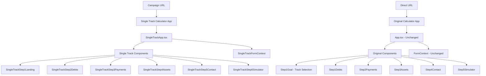

# Design Document: Single Track Calculator

## Overview

The single-track calculator creates a campaign-optimized version of the existing mortgage calculator that bypasses track selection and provides a focused user experience for the "reduce monthly installments" track. This design maintains the existing calculator architecture while creating a separate product instance that eliminates choice paralysis for campaign users.

## Architecture

### High-Level Architecture

The solution implements complete application separation with two independent calculator applications:



### Product Separation Strategy

The design implements complete separation through:

1. **Separate Applications**: Two independent React applications with their own entry points
2. **Independent Components**: Each app has its own set of step components
3. **Isolated Contexts**: Completely separate form contexts with no shared state
4. **Simple Routing**: Basic routing to serve different apps based on URL
5. **No Shared Logic**: Each app operates independently without cross-dependencies

## Components and Interfaces

### New Single Track Application

#### SingleTrackApp Component
```typescript
interface SingleTrackAppProps {
  campaignId?: string;
  utmParams?: Record<string, string>;
}

const SingleTrackApp: React.FC<SingleTrackAppProps> = ({ campaignId, utmParams }) => {
  // Independent single-track calculator application
}
```

#### SingleTrackFormProvider Component
```typescript
interface SingleTrackFormData {
  // Simplified form data specific to monthly reduction track
  step: number;
  mortgageBalance: number;
  otherLoansBalance: number;
  bankAccountBalance: number;
  mortgagePayment: number;
  otherLoansPayment: number;
  targetTotalPayment: number;
  propertyValue: number;
  leadName: string;
  leadPhone: string;
  age: number | null;
  oneTimePaymentAmount: number;
  
  // Campaign tracking
  campaignId?: string;
  utmParams?: Record<string, string>;
}

const SingleTrackFormProvider: React.FC<{ children: ReactNode }> = ({ children }) => {
  // Independent form context for single-track calculator
}
```

#### Single Track Step Components
```typescript
// Each step component is independent and specific to single-track flow
const SingleTrackStep1Landing: React.FC = () => {
  // Campaign-optimized landing page
}

const SingleTrackStep2Debts: React.FC = () => {
  // Debt collection step (similar to existing but independent)
}

const SingleTrackStep3Payments: React.FC = () => {
  // Payment collection step (similar to existing but independent)
}

// ... additional step components
```

### Original Application (Unchanged)
- App.tsx remains completely unchanged
- All existing components remain unchanged
- FormContext.tsx remains unchanged
- No modifications to existing functionality

### Routing Strategy

#### Simple File-Based Routing
- Original Calculator: `index.html` → `App.tsx` (existing behavior)
- Single Track Calculator: `reduce-payments.html` → `SingleTrackApp.tsx`
- Or URL-based routing: `/` vs `/reduce-payments`

## Data Models

### Single Track Form Data
```typescript
interface SingleTrackFormData {
  // Step tracking
  step: number;
  
  // Step 2 - Debts (same as original)
  mortgageBalance: number;
  otherLoansBalance: number;
  bankAccountBalance: number;
  
  // Step 3 - Monthly Payments (same as original)
  mortgagePayment: number;
  otherLoansPayment: number;
  targetTotalPayment: number;
  
  // Step 4 - Assets (same as original)
  propertyValue: number;
  
  // Step 5 - Contact (same as original)
  leadName: string;
  leadPhone: string;
  
  // Step 6 - Simulator (same as original)
  age: number | null;
  oneTimePaymentAmount: number;
  
  // Campaign tracking (new)
  campaignId?: string;
  utmParams?: Record<string, string>;
  landingPageViewed?: boolean;
}
```

### Campaign Tracking Model
```typescript
interface CampaignData {
  campaignId: string;
  source: 'facebook' | 'google' | 'direct';
  utmParams: {
    utm_source?: string;
    utm_medium?: string;
    utm_campaign?: string;
    utm_content?: string;
    utm_term?: string;
  };
  landingTime: Date;
}
```

### Single Track Configuration
```typescript
interface SingleTrackConfig {
  landingPage: {
    title: string;
    subtitle: string;
    ctaText: string;
    valueProposition: string[];
  };
  steps: {
    totalSteps: 6;
    stepTitles: Record<number, string>;
    stepDescriptions: Record<number, string>;
  };
  analytics: {
    trackCampaignEvents: boolean;
    conversionGoals: string[];
  };
}
```

## Correctness Properties

*A property is a characteristic or behavior that should hold true across all valid executions of a system-essentially, a formal statement about what the system should do. Properties serve as the bridge between human-readable specifications and machine-verifiable correctness guarantees.*

### Property 1: Single Track Navigation Enforcement
*For any* user session in the single-track calculator, the system should bypass track selection, initialize with the MONTHLY_REDUCTION track, prevent track switching, and maintain the single track throughout all navigation attempts.
**Validates: Requirements 1.1, 1.2, 1.3, 1.4**

### Property 2: Campaign-Optimized Landing Page
*For any* single-track calculator entry, the landing page should display campaign-optimized content that clearly communicates the "reduce monthly installments" value proposition.
**Validates: Requirements 2.1, 2.2**

### Property 3: Predefined Flow Navigation
*For any* user interaction with the landing page step, the system should guide users through the predefined reduce-monthly-installments flow sequence without deviation.
**Validates: Requirements 2.3**

### Property 4: Single Track Restart Behavior
*For any* restart action in the single-track calculator, the system should return to the landing page step while maintaining single-track context and preserving the campaign-optimized experience.
**Validates: Requirements 3.1, 3.2, 3.3**

### Property 5: Product Isolation
*For any* calculator access, the system should maintain clear separation between original and single-track products, with original providing full track selection and single-track providing focused experience, without cross-contamination.
**Validates: Requirements 4.1, 4.2, 4.3, 4.4, 4.5**

### Property 6: Campaign Integration
*For any* Facebook campaign user arrival, the system should route to single-track calculator, maintain campaign context throughout the session, provide conversion tracking, and support URL parameters for analytics.
**Validates: Requirements 5.1, 5.2, 5.3, 5.4**

<function_calls>
<invoke name="prework">
<parameter name="featureName">single-track-calculator

## Error Handling

### Single Track Context Errors
- **Missing Campaign ID**: Gracefully handle missing campaign parameters by using default single-track behavior
- **Invalid Track Configuration**: Fall back to MONTHLY_REDUCTION track if configuration errors occur
- **Context Initialization Failures**: Provide fallback context with single-track defaults

### Navigation Errors
- **Invalid Step Navigation**: Prevent navigation outside the single-track flow boundaries
- **Track Switch Attempts**: Silently ignore track switching attempts and maintain current track
- **URL Manipulation**: Validate and sanitize URL parameters to prevent malicious input

### Campaign Integration Errors
- **UTM Parameter Parsing**: Handle malformed or missing UTM parameters gracefully
- **Analytics Tracking Failures**: Continue normal operation if tracking services are unavailable
- **Conversion Event Errors**: Log conversion failures without disrupting user experience

### Fallback Strategies
```typescript
interface ErrorFallbacks {
  contextInitialization: () => SingleTrackContextType;
  campaignDataParsing: (url: string) => CampaignData | null;
  trackConfigurationError: () => TrackConfig;
  navigationError: (currentStep: number) => number;
}
```

## Testing Strategy

### Dual Testing Approach
The testing strategy combines unit tests for specific scenarios and property-based tests for comprehensive coverage:

**Unit Tests Focus:**
- Specific campaign URL parsing scenarios
- Error handling edge cases
- Component integration points
- Analytics event firing

**Property Tests Focus:**
- Universal navigation behavior across all user sessions
- Campaign context preservation throughout random user actions
- Product isolation across different access patterns
- Landing page content consistency across all entries

### Property-Based Testing Configuration
- **Testing Library**: React Testing Library with fast-check for property generation
- **Minimum Iterations**: 100 iterations per property test
- **Test Tagging**: Each property test tagged with format: **Feature: single-track-calculator, Property {number}: {property_text}**

### Test Categories

#### Navigation Tests
- Single-track initialization across various entry points
- Track switching prevention under all user actions
- Restart behavior consistency across multiple cycles

#### Campaign Integration Tests
- URL parameter parsing for various campaign formats
- Analytics event tracking across different user flows
- Conversion tracking accuracy for completed flows

#### Product Separation Tests
- Original calculator functionality preservation
- Single-track calculator isolation verification
- Cross-product contamination prevention

#### Error Handling Tests
- Graceful degradation when campaign data is missing
- Fallback behavior when tracking services fail
- Recovery from invalid navigation attempts

### Integration Testing
- End-to-end campaign user journeys
- Cross-browser compatibility for campaign URLs
- Analytics integration verification
- Performance impact assessment of dual-product architecture